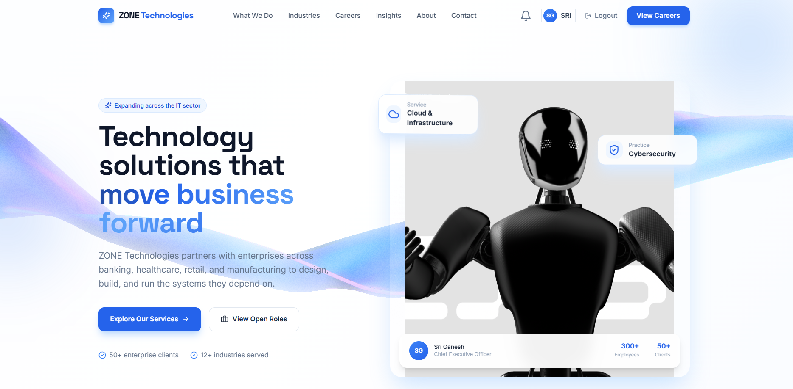
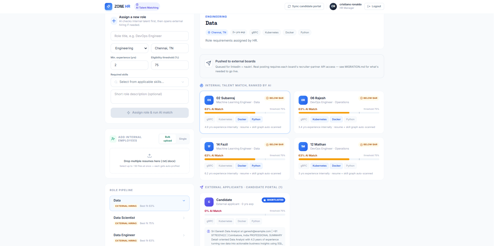
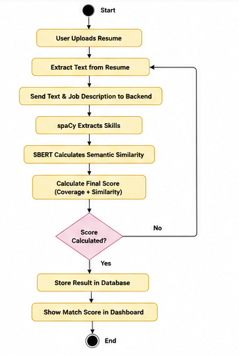
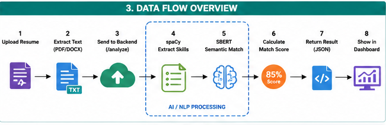

# 🚀 TalentSphere AI
### AI-Powered Resume & Job Matching Platform
TalentSphere AI is a Full Stack AI-powered recruitment platform that automates resume screening and candidate-job matching using Natural Language Processing (NLP), Semantic Search, and Large Language Models (LLMs).
The platform enables HR professionals to create jobs, automatically rank candidates based on resume relevance, and receive AI-generated explanations for every recommendation.

## Candidate Dashboard




## HR Dashboard



## Activity Diagram




## Data Flow Diagram




# 📌 Features
## 👨💼 Candidate Module
- User Registration & Login
- Resume Upload (PDF/DOCX)
- Browse Available Jobs
- Apply for Jobs
- Track Application Status

## 🏢 HR Module
- HR Authentication
- Create & Manage Job Posts
- View Applicants
- Automatic Resume Screening
- AI Match Score (0–100)
- Shortlist / Reject Candidates
- AI-generated Candidate Evaluation
- AI-generated Interview Questions

---

 


# 🛠️ Tech Stack

## Frontend
- React (Vite)
- Tailwind CSS


## Backend
- FastAPI
- Python
## Database
- Supabase (PostgreSQL)
- Supabase Authentication
## AI & NLP
- spaCy
- Sentence Transformers (SBERT)
- all-MiniLM-L6-v2
- Groq API (Llama 3.3 70B)
# 📂 Project Structure
TalentSphere-AI
│
├── frontend/
│   ├── src/
│   ├── components/
│   ├── pages/
│   └── assets/
│
├── backend/
│   ├── main.py
│   ├── services/
│   │      ├── skill_extractor.py
│   │      ├── semantic_matcher.py
│   │      └── skills_data.py
│   │
│   └── requirements.txt
│
├── supabase/
│
├── README.md
│
└── LICENSE

# 🔄 Resume Matching Workflow

### Step 1
Candidate uploads resume.
↓
### Step 2
Resume text is extracted.
↓
### Step 3
spaCy identifies technical skills using PhraseMatcher and alias mapping.
↓
### Step 4
SBERT converts the resume and job description into embeddings.
↓
### Step 5
Cosine Similarity is calculated.
↓

### Step 6
Skill Coverage + Semantic Similarity are combined.
↓
### Step 7
Final Match Score (0–100) is generated.
↓
### Step 8
Groq AI generates:
- Match Explanation
- Interview Questions
- HR Recommendation
↓
### Step 9
Results appear on the HR Dashboard.
---
# 📊 AI Models Used

| Model | Purpose |
|---------|---------|
| spaCy | Skill Extraction |
| PhraseMatcher | Alias Matching |
| SBERT (all-MiniLM-L6-v2) | Semantic Similarity |
| Groq (Llama 3.3 70B) | AI Resume Analysis |
| TF-IDF | Fallback Matching |

---

# 🚀 Installation

## Clone Repository

```bash
git clone https://github.com/yourusername/TalentSphere-AI.git
```

```
cd TalentSphere-AI
```

---

## Frontend

```bash
cd frontend
npm install
npm run dev
```

---

## Backend

```bash
cd backend
pip install -r requirements.txt

uvicorn main:app --reload
```

---

## Environment Variables

Create a `.env` file.

```
SUPABASE_URL=

SUPABASE_KEY=

GROQ_API_KEY=
```

---


